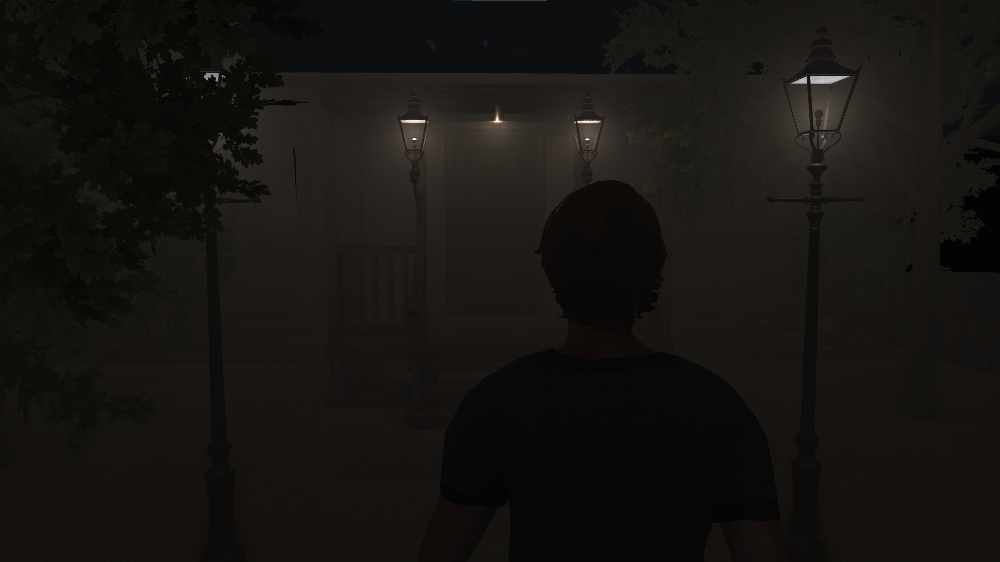
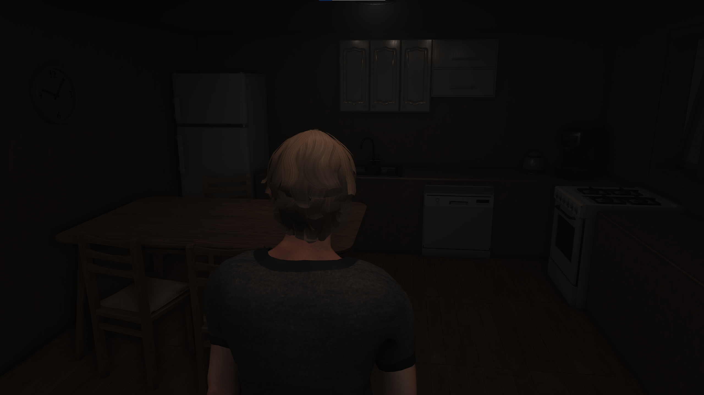
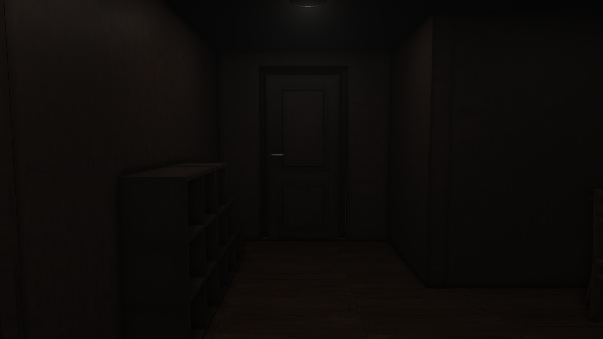
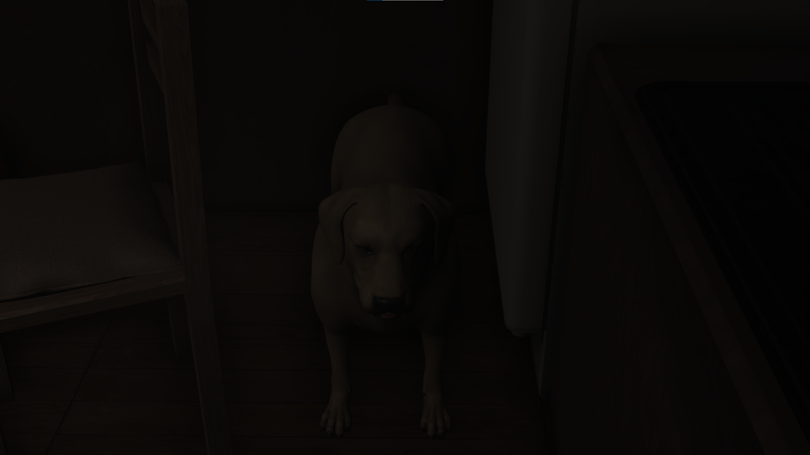

# Rewind-Prototype
A prototype of an interactive drama game made in 7 days for a game jam. Built on a custom C++/OpenGL game engine.

## Controls
**WASD** - move  
**E** - interact

## Tech

**Engine:**
- Custom C++ / OpenGL 4.3 engine built from scratch
- ~15,000+ lines of C++ code

**Rendering:**
- Forward rendering with PBR (Physically Based Rendering)
- IBL (Image Based Lighting) - diffuse and specular
- Light Probes with CPU-based baking (SH coefficients)
- Screen-Space Volumetric Fog
- GPU skinning for animated characters
- Frustum culling and shadow mapping (PCF)

**Post-processing:**
- Bloom, SSAO, DOF, FXAA, Color Grading

**Systems:**
- Custom UI (buttons, sliders, text, progress bars, combo boxes)
- QTE system, ChoiceSystem, Triggers

**Libraries:**
- OpenAL for 3D audio
- Assimp for FBX/OBJ import
- Bullet Physics for collision detection

## Status
**Prototype.** A complete version - **Rewind: Complete Edition** - is planned with more locations, more interactive objects, multiple endings, and a longer, more polished experience.

## Credits

**3D Models (modified or used as reference):**
- Wooden Door - [Sketchfab](https://sketchfab.com/3d-models/wooden-door-8726b6c219a54ed585e096f267c2a35e)
- Simple Dining Table - [Sketchfab](https://sketchfab.com/3d-models/simple-dining-table-a6deba91a7f9435082369e33f8db0dd6)
- Labrador Dog (idle animation added) - [Sketchfab](https://sketchfab.com/3d-models/labrador-dog-1f56cfbab07e4fe49b5d9e521c82073a)
- Realistic Trees Collection - [Sketchfab](https://sketchfab.com/3d-models/realistic-trees-collection-fe67c886eebf4bcb988d7c45e69995ad)
- Cardboard Box - [Sketchfab](https://sketchfab.com/3d-models/cardboard-box-c4e96709c1c9469bace0dceec55ae608)
- Wood Fence - [Sketchfab](https://sketchfab.com/3d-models/wood-fence-c094a54cbaae4638bbee03625fbd9610)
- Ground Pebbles - [Sketchfab](https://sketchfab.com/3d-models/ground-pebbles-4caf4887845f4e04bcf68bc3df36afe9)
- Road Pack - [Sketchfab](https://sketchfab.com/3d-models/road-pack-fb178f10ee2443baafa0aa8b1db5376b)
- Kitchen Appliances - [Sketchfab](https://sketchfab.com/3d-models/kitchen-appliances-0b01a398fe1649aaacd6ebdf85bf5d6c)
- Kitchen Cabinet - [Sketchfab](https://sketchfab.com/3d-models/kitchen-cabinet-68542280aab04f03b67f9dae08e7a0ce)
- Bedside Table - [Sketchfab](https://sketchfab.com/3d-models/bedside-table-b25de0eb97c64a00a538f09fc7072f67)
- Wall Mount Hook Hanger - [Sketchfab](https://sketchfab.com/3d-models/wall-mount-hook-hanger-clothes-bdc9f8d8c796412f9c1dff3b889442e5)
- Dog Bowl - [Sketchfab](https://sketchfab.com/3d-models/dog-bowl-3fc962f14b994f81a5924f9b100dcb2f)

**Everything else:**
Game design, engine, code, lighting, scene layout, and modifications - made by me.

**Note on AI use:**
AI tools were used as a coding assistant - for generating boilerplate code, suggesting solutions, and speeding up development. All final decisions, architecture, integration, and debugging were done manually by me.

## Links
- [Play on Itch.io](https://vlad03.itch.io/rewind)
- [Download full game (Releases)](https://github.com/Vlad326/Rewind-Prototype/releases)

## Screenshots
| Prologue | Kitchen |
|----------|---------|
|  |  |

| Hallway | River |
|---------|-------|
|  |  |
